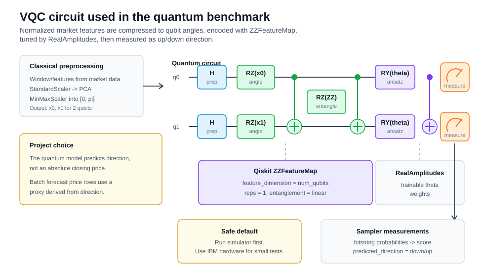
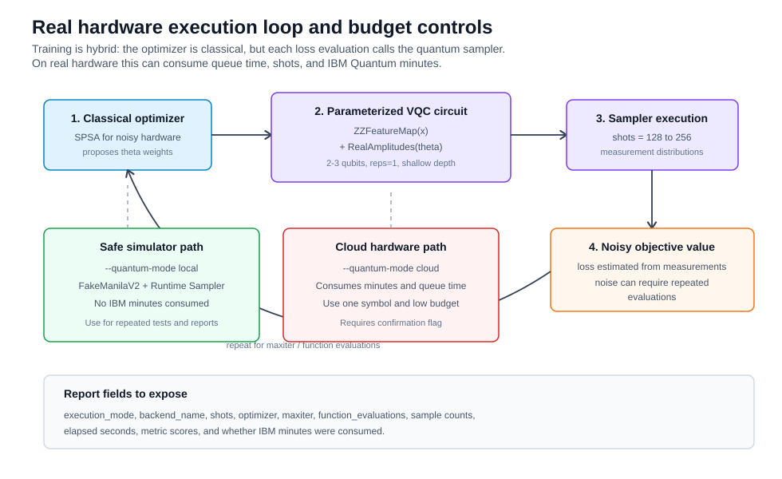

<div align="center">

# Hybrid Classical-Quantum Stock Forecasting
## Semiconductor Equities · LSTM + Qiskit + FastAPI

[](https://python.org)
[](https://tensorflow.org)
[](https://qiskit.org)
[](https://fastapi.tiangolo.com)
[](LICENSE)

Production-grade forecasting pipeline for semiconductor stocks — classical Keras LSTM baseline
versus offline IBM Quantum (Qiskit) experiments — served via FastAPI with a promotion policy
for safe, reproducible model serving.

**Universe:** `NVDA` · `AMD` · `TSM` · `ASML` · `QCOM` | **Target:** next-day close (D+1)

</div>

---

## Why this project

Semiconductor equities are among the most volatile and strategically relevant assets in the
current market cycle. This repository explores whether quantum-enhanced feature encoding can
improve next-day closing-price regression beyond a strong classical LSTM baseline.

The classical path is fully production-ready: ingestion, feature engineering, training,
promotion policy, and FastAPI serving. The quantum path runs offline via IBM Quantum (Qiskit),
and its materialized forecasts are served alongside classical predictions through the same API
endpoint — enabling direct, apples-to-apples comparison without live quantum inference latency.

**Key design decisions:**
- Clean architecture (domain / application / infrastructure) keeps quantum and classical paths
  fully decoupled and independently testable.
- A promotion policy (`models/serving_promotions.json`) gates which artifacts reach production,
  preventing degraded or partially-materialized models from being served.
- All forecast partitions are immutable and addressable by `extraction_date`, ensuring
  reproducibility across runs.

---

## Visual Guide

Each diagram highlights one discussion topic for project walkthroughs.

| Topic | Diagram |
|---|---|
| Current architecture vs `[NEW]` roadmap |  |
| Semiconductor market rationale |  |
| Classical production path vs offline quantum comparison |  |
| VQC circuit architecture used in the benchmark |  |
| Real hardware execution loop and budget controls |  |
| Active API endpoints and forecast serving flow |  |

---

## Table of Contents

| Section | Description |
|---|---|
| [Why this project](#why-this-project) | Motivation and key design decisions |
| [Visual Guide](#visual-guide) | Diagrams for project walkthroughs |
| [About](#about) | Scope and current implementation status |
| [Architecture](#architecture) | Project layers and data flow |
| [Repository Structure](#repository-structure) | Actual folders and key files |
| [Quickstart](#quickstart) | Local setup and execution |
| [Pipeline](#pipeline) | Raw, refined, feature, training, and forecast generation |
| [Quantum Benchmark Strategy](#quantum-benchmark-strategy) | Simulator, hardware, normalization, and cost controls |
| [Promotion Policy](#promotion-policy) | Serving approval rules for classical models |
| [API](#api) | Current FastAPI endpoints and behavior |
| [Quality](#quality) | Tests, linting, and current CI status |
| [Deployment](#deployment) | What is and is not committed today |
| [Author](#author) | Project author |

---

## About

This repository implements the Phase 4 Tech Challenge deliverable for the Machine Learning Engineering postgraduate program. The codebase covers:

- raw market-data ingestion from Yahoo Finance via `yfinance`
- refined and feature dataset generation
- classical Keras LSTM training for next-day closing-price regression
- offline quantum comparison experiments
- materialized future forecast datasets served through FastAPI and a read-only Flask frontend

Current implementation status:

- `POST /predict` is active and serves only approved classical artifacts.
- `GET /forecasts/{symbol}` is active and serves precomputed `normal` and `quant` rows from parquet.
- `POST /predict/enriched` and `GET /news/{symbol}` are placeholders and currently return `501 Not Implemented`.
- Docker, Prometheus, Grafana, and test CI workflow files are not committed in the current repository snapshot. A GitHub Pages workflow publishes the static dashboard from `site/`.

Scope summary:

| Item | Detail |
|---|---|
| Primary asset | `NVDA` |
| Multi-asset universe | `NVDA`, `AMD`, `TSM`, `ASML`, `QCOM` |
| Prediction target | Next-day close (`D+1`) |
| Online serving | Classical LSTM only |
| Offline forecast serving | `normal` and `quant` materialized rows |
| Promotion policy | `models/serving_promotions.json` |
| Current promoted extraction date | `2026-05-19` |
| Current promoted training run | `20260525T131034Z` |
| Current forecast package | `data/processed/future_predict`, generated at `20260525T143920Z` |

---

## Architecture

The repository follows a layered structure centered on FastAPI, application services, and filesystem-backed datasets and model artifacts.

```text
FastAPI routes
    -> use cases
        -> application services
            -> local processed/raw/model stores
                -> parquet, json, keras, and dill artifacts
```

Key modules:

- `src/api/`: FastAPI entrypoint, routes, schemas, and dependency wiring.
- `src/application/`: prediction services, forecast services, and training use cases.
- `src/domain/`: entities and interfaces.
- `src/infrastructure/`: configuration, storage, and repository adapters.
- `src/front/`: read-only Flask frontend for inspection and demos.

For the broader technical rationale, see [ARCHITECTURE.md](ARCHITECTURE.md).

---

## Repository Structure

The current repository layout is:

```text
tech-challenge-phase4/
+-- Docs/
|   `-- 2026-05-05-final-audit-report.md
+-- data/
|   +-- raw/
|   `-- processed/
+-- models/
|   +-- manifests/
|   +-- training_runs/
|   +-- comparison_runs/
|   +-- quantum_training_runs/
|   +-- serving_promotions.json
|   `-- lstm_*.keras
+-- notebooks/
+-- scripts/
|   +-- generate_raw.py
|   +-- generate_refined.py
|   +-- generate_features.py
|   +-- train_keras.py
|   +-- train_model_quantum.py
|   +-- train_and_compare_models.py
|   +-- generate_forecast.py
|   +-- provision_athena.py
|   +-- backfill_model_artifact_references.py
|   +-- run_front.py
|   `-- test_ibm_quantum.py
+-- src/
|   +-- api/
|   +-- application/
|   +-- domain/
|   +-- front/
|   `-- infrastructure/
+-- tests/
|   +-- test_api_endpoints.py
|   `-- test_news_aggregator_service.py
+-- ARCHITECTURE.md
+-- requirements.txt
+-- requirements-dev.txt
`-- README.md
```

Generated partitions under `data/raw/`, `data/processed/`, and `models/training_runs/` are intentionally omitted for brevity.

---

## Quickstart

### Prerequisites

- Python 3.11+
- Git

### Local setup

```bash
# 1. Clone
git clone https://github.com/guilherme-lossio/tech-challenge-phase4.git
cd tech-challenge-phase4

# 2. Create and activate a virtual environment
python -m venv .venv
source .venv/bin/activate          # Linux / macOS
.venv\Scripts\activate             # Windows PowerShell

# 3. Install runtime dependencies
pip install -r requirements.txt

# 4. Install development dependencies
pip install -r requirements-dev.txt

# 5. Create local environment file
cp .env.example .env               # Linux / macOS
copy .env.example .env             # Windows
```

### Run the API

```bash
uvicorn src.api.main:app --reload --host 0.0.0.0 --port 8000
```

### Run the frontend

```bash
python scripts/run_front.py
```

Useful local URLs:

| Service | URL |
|---|---|
| FastAPI Swagger UI | http://localhost:8000/docs |
| FastAPI ReDoc | http://localhost:8000/redoc |
| Flask frontend | http://localhost:5001/ |

### Export a static GitHub Pages build

The Flask frontend can be rendered as static HTML for GitHub Pages. The published site
contains pre-rendered HTML/CSS and does not call S3, FastAPI, or model endpoints from
the browser.

```bash
# Export static pages into ./site.
python scripts/export_static_front.py --clean
```

The GitHub Pages workflow publishes the committed `site/` directory directly. To update
the public snapshot, regenerate `site/` locally with the data artifacts available, then
commit the updated files.

### Environment variables

Important local variables:

```env
RAW_LOCAL_DIR=data/raw
PROCESSED_LOCAL_DIR=data/processed
MODELS_DIR=models
AWS_REGION=us-east-1
S3_BUCKET_RAW=
S3_BUCKET_REFINED=
S3_BUCKET_PROCESSED=
S3_BUCKET_MODEL=
ATHENA_DATABASE=tech_challenge_phase4
ATHENA_WORKGROUP=primary
ATHENA_OUTPUT_S3_URI=
```

Notes:

- News API credentials are optional because the news endpoints are not active yet.
- The API never triggers live IBM Quantum inference at request time.
- `requirements.txt` contains runtime dependencies only; `requirements-dev.txt` adds `pytest`, `pytest-cov`, `httpx`, `black`, `flake8`, and `pre-commit`.

---

## Pipeline

The pipeline is organized as independent scripts.

### 1. Generate raw market data

```bash
python scripts/generate_raw.py --skip-s3
```

Output examples:

```text
data/raw/market_data/source=yfinance/symbol=NVDA/extraction_date=2026-04-22/ohlcv.csv
data/raw/manifests/extraction_date=2026-04-22/raw_manifest.json
```

### 2. Generate refined datasets

```bash
python scripts/generate_refined.py --skip-s3
```

### 3. Generate feature datasets

```bash
python scripts/generate_features.py --skip-s3
```

Training prefers feature datasets when they exist for the same extraction date.

### 4. Train the classical Keras baseline

```bash
python scripts/train_keras.py --skip-s3
python scripts/train_keras.py --extraction-date 2026-04-22 --symbols NVDA AMD TSM ASML QCOM --verbose 0
```

Training outputs:

- immutable artifacts under `models/training_runs/...`
- training manifests under `models/manifests/extraction_date=<date>/trained_at=<timestamp>/keras_training_manifest.json`
- published convenience aliases under `models/lstm_*.keras`
- return-target runs use `models/lstm_return_*.keras` and are supported by the current serving policy when explicitly promoted

### 5. Generate future forecasts

```bash
python scripts/generate_forecast.py --skip-s3 --skip-athena
```

Output example:

```text
data/processed/future_predict/source=yfinance/symbol=NVDA/lookback=60/horizon_days=162/extraction_date=2026-05-19/generated_at=20260525T143920Z/future_predict.parquet
```

To forecast through a fixed calendar date, let the script derive the business-day horizon:

```bash
python scripts/generate_forecast.py --forecast-end-date 2026-12-31
```

For extraction date `2026-05-19`, this produces `horizon_days=162` from the next business date (`2026-05-20`) through `2026-12-31`, publishes the parquet files to S3 when S3 is configured, and repairs the Athena `future_predict` table unless `--skip-athena` is used.

### 6. Compare classical and quantum paths

Quantum training is disabled by default. The normal training path should stay classical.
Legacy local-simulator comparison requires an explicit escape hatch:

```bash
python scripts/train_and_compare_models.py --extraction-date 2026-04-22 --quantum-mode local --allow-local-quantum-training --skip-s3
```

The script refuses `--quantum-mode cloud` before heavy imports. IBM Quantum hardware is reserved for forecast inference only, never training.

Small IBM Quantum forecast-inference run:

```bash
python scripts/generate_forecast.py --symbols NVDA --extraction-date 2026-04-26 --skip-normal --horizon-days 1 --quantum-runtime-mode cloud --quantum-shots 128 --max-cloud-quantum-predictions 1 --confirm-ibm-runtime-cost --skip-s3 --skip-athena
```

Cloud prediction can consume IBM Quantum runtime minutes. It requires `--confirm-ibm-runtime-cost` and is capped by `--max-cloud-quantum-predictions`, where requested predictions are roughly `symbols * horizon_days`.

The generated `comparison_report.md` includes directional metrics, confusion matrices, execution environment, backend, shots, optimizer budget, available function-evaluation metadata, IBM hardware observability guidance, a cost-profile note, and an article-ready Keras vs Qiskit comparison table.

When S3 upload is enabled, this comparison script publishes the Keras and Quantum training artifacts plus the comparison dashboard, confusion-matrix image, markdown report, and comparison manifest under the configured model bucket/prefix. Use `--skip-s3` to keep all of those artifacts local only.

For fair directional metrics, the comparison script trains a separate Keras LSTM classifier with `binary_crossentropy`, balanced class weights, the same sampled split sizes used by the VQC, and an `Always Up` dummy baseline. The original Keras price regressor is still trained for MAE/RMSE/MAPE context.

Each comparison run also writes `unified_comparison_report.md` at the run root (`models/comparison_runs/extraction_date=<date>/generated_at=<timestamp>/`). This file consolidates the per-symbol reports generated in that same moment and is also uploaded to S3 when S3 publication is enabled.

### 7. Backfill manifest artifact references

```bash
python scripts/backfill_model_artifact_references.py
```

This script annotates historical manifests with:

- `immutable_model_local_path`
- `published_model_local_path`
- `artifact_reference_mode`

---

## Quantum Benchmark Strategy

The project treats the quantum path as an experimental benchmark, not as a production replacement for the classical LSTM. The intended comparison has three layers:

| Layer | Purpose | IBM Quantum cost |
|---|---|---:|
| Classical Keras LSTM | Production baseline and next-day price regression | none |
| Qiskit simulator | Quantum pipeline validation and repeatable local comparison | none |
| IBM Quantum hardware | Forecast inference only on a real backend | consumes minutes |

The quantum model receives normalized and compressed inputs:

```text
market window/features
    -> StandardScaler
    -> PCA to num_qubits dimensions
    -> MinMaxScaler into [0, pi]
    -> ZZFeatureMap angle encoding
    -> RealAmplitudes variational ansatz
    -> Sampler measurements
    -> direction class: down/up
```

Circuit diagrams:

- [VQC circuit architecture](Docs/graphs/quantum_vqc_circuit_architecture.svg)
- [Quantum hardware execution loop](Docs/graphs/quantum_hardware_execution_loop.svg)

Recommended hardware limits for forecast inference:

| Parameter | Suggested value |
|---|---:|
| `horizon_days` | 1 to 5 |
| `symbols` | 1 |
| `quantum_shots` | 128 to 256 |
| `max_cloud_quantum_predictions` | equal to `symbols * horizon_days` |

The final report exposes backend, execution mode, shots, optimizer, function evaluations when available, elapsed time, sample counts, directional metrics, and whether IBM Quantum minutes were consumed. The full decision note is in [Docs/2026-05-16-quantum-simulator-and-real-hardware-benchmark.md](Docs/2026-05-16-quantum-simulator-and-real-hardware-benchmark.md).

Current report sections added for quantum methodology:

- execution environment and cost profile
- IBM real-hardware variables: queue time, execution time, noise, T1/T2, readout error, mitigation
- IBM job observability checklist for future `job.metrics()` / `job.result().metadata` capture
- cost model note using article-level assumptions such as QPU seconds × assumed USD/QPU-second
- Keras vs Qiskit comparison table for article discussion

---

## Promotion Policy

Online prediction serving is governed by `models/serving_promotions.json`.

Rules:

- Only artifacts listed in that file are eligible for `POST /predict` serving resolution.
- Each approved entry must point to an immutable `models/training_runs/...` artifact.
- If a newer training partition exists but is not approved, the API falls back to the newest approved artifact on or before the requested `extraction_date`.
- Legacy manifests that only reference mutable top-level aliases are excluded from serving selection when the promotion policy is active.

This policy keeps online serving stable even when the latest training run is degraded or only partially materialized.

Current serving alignment:

| Item | Value |
|---|---|
| Promoted serving extraction date | `2026-05-19` |
| Promoted Keras training run | `20260525T131034Z` |
| Promoted model prefix | `lstm_return` |
| Materialized forecast package | `data/processed/future_predict` |
| Forecast generation token | `20260525T143920Z` |
| Forecast window | `2026-05-20` to `2026-12-31` |
| Forecast horizon | `162` business days |
| Forecast predict types | `normal`, `quant` |
| Symbols | `AMD`, `ASML`, `NVDA`, `QCOM`, `TSM` |

This means `/health`, `/methods`, `/data-usage`, `POST /predict`, and `GET /forecasts/{symbol}` now resolve to the same default `latest_extraction_date=2026-05-19` when local artifacts are available.

---

## API

The API is documented at `/docs`.

### `GET /health`

Returns status, API version, uptime, default classical model metadata, supported symbols, and aligned extraction-date metadata.

### `POST /predict`

Supports two request modes:

- `symbol` + exactly 60 prices
- `symbol` + optional `extraction_date` + optional `reference_date` when the API should build the 60-day window from local data

Example:

```json
{
  "symbol": "NVDA",
  "prices": [208.27, 208.27, 208.27, 208.27, 208.27]
}
```

The real request must provide exactly 60 values.

### `GET /forecasts/{symbol}`

Serves materialized forecast rows from `data/processed/future_predict`.

Supported query parameters:

- `predict_type=all|normal|quant`
- `extraction_date=YYYY-MM-DD`
- `forecast_date_from=YYYY-MM-DD`
- `forecast_date_to=YYYY-MM-DD`
- `lookback=60`
- `horizon_days=162`
- `limit=<n>`

When `extraction_date` is omitted, the route uses the same aligned default date advertised by `/health`, `/methods`, and `/data-usage`.

### `POST /predict/enriched`

Returns `501 Not Implemented` in the current version.

### `GET /news/{symbol}`

Returns `501 Not Implemented` in the current version.

### `GET /methods`

Returns the machine-readable method catalog and aligned extraction-date metadata.

### `GET /data-usage`

Returns the data-source summary, lookback and horizon configuration, supported symbols, and serving-policy notes.

### `GET /metrics`

Returns Prometheus-compatible text metrics.

Current error semantics:

| Status | Condition |
|---|---|
| `404` | Requested materialized forecast partition was not found |
| `422` | Invalid payload or unsupported request shape |
| `503` | Model unavailable or no approved serving artifact could be resolved |

---

## Quality

### Tests

```bash
python -m unittest discover -s tests
pytest tests -q
```

Current regression coverage includes:

- FastAPI endpoint alignment tests for `/predict`, `/forecasts/{symbol}`, `/health`, `/methods`, and `/data-usage`
- news deduplication regression tests for timezone-aware and missing timestamps

### Forecast quality audit

The current delivery forecast package (`extraction_date=2026-05-19`, `generated_at=20260525T143920Z`) was audited against the `2026-05-25` raw market-data partition.

Current audit status:

- realized comparison rows are available for the first 3 forecast business days
- `normal` and `quant` rows no longer report `compared_rows=0`
- guardrail constraint rate is `0.00%` across the active package
- the remaining model-quality risk is monotonic recursive shape in the `normal` LSTM path
- baseline comparison is documented in [Docs/2026-05-25-forecast-quality-realized-audit.md](Docs/2026-05-25-forecast-quality-realized-audit.md)

Run the audit locally with:

```bash
python scripts/forecast_quality_audit.py --actual-extraction-date 2026-05-25
```

### Linting

```bash
black --check src tests scripts
flake8 src tests scripts
```

### CI status

The repository includes `.github/workflows/pages.yml` for GitHub Pages deployment. No test/lint CI pipeline is committed in the current repository snapshot, so the validated QA flow is local.

---

## Deployment

Container, compose, Prometheus, and Grafana assets are not committed today.

The supported execution model in this repository is:

- local virtualenv for API and frontend
- filesystem-backed raw, processed, and model artifacts
- optional S3 and Athena publication through the provided scripts

If containerization is added later, it must include:

- `data/`
- `models/`
- `.env`
- `models/serving_promotions.json`
- immutable `models/training_runs/...` artifacts referenced by the promotion policy

---

## Author

**Guilherme Lossio**  
Postgraduate Program in Machine Learning Engineering  
Tech Challenge - Phase 4

- GitHub: https://github.com/guilherme-lossio
- LinkedIn: https://linkedin.com/in/guilherme-lossio
